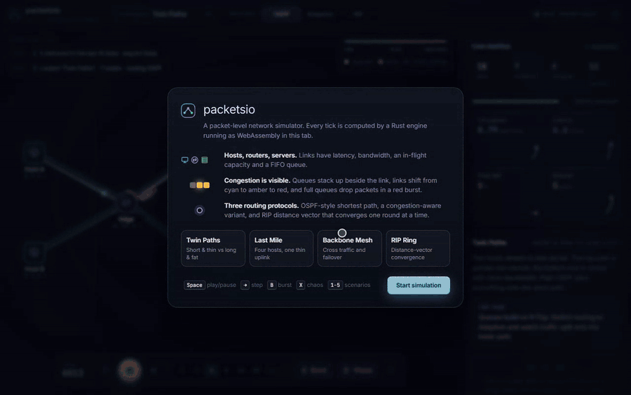
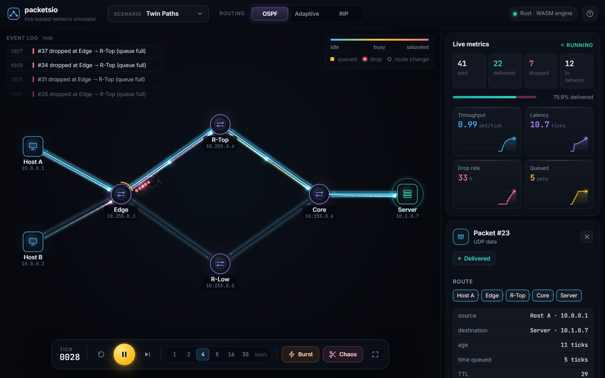
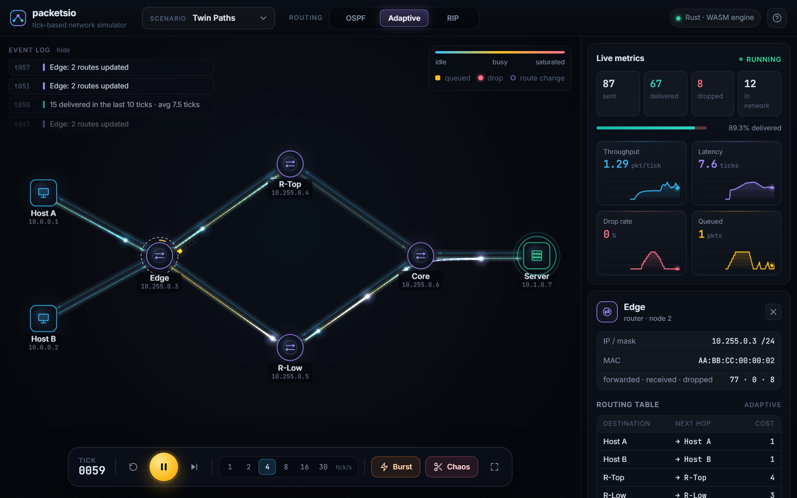
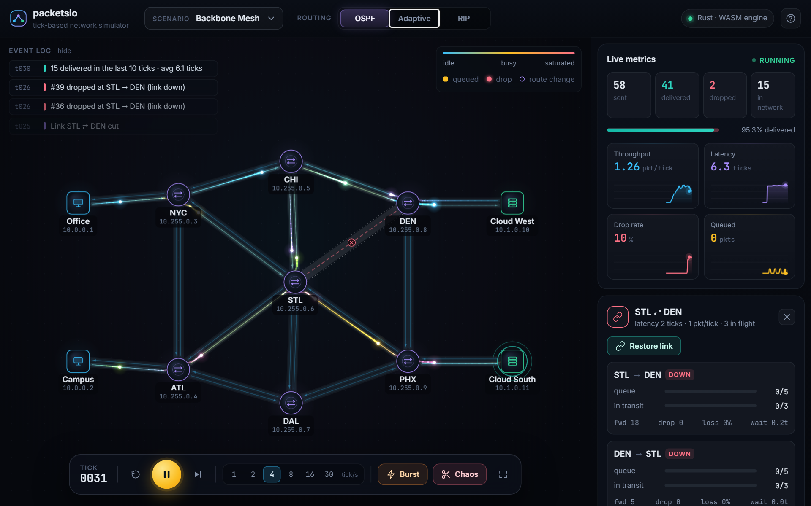
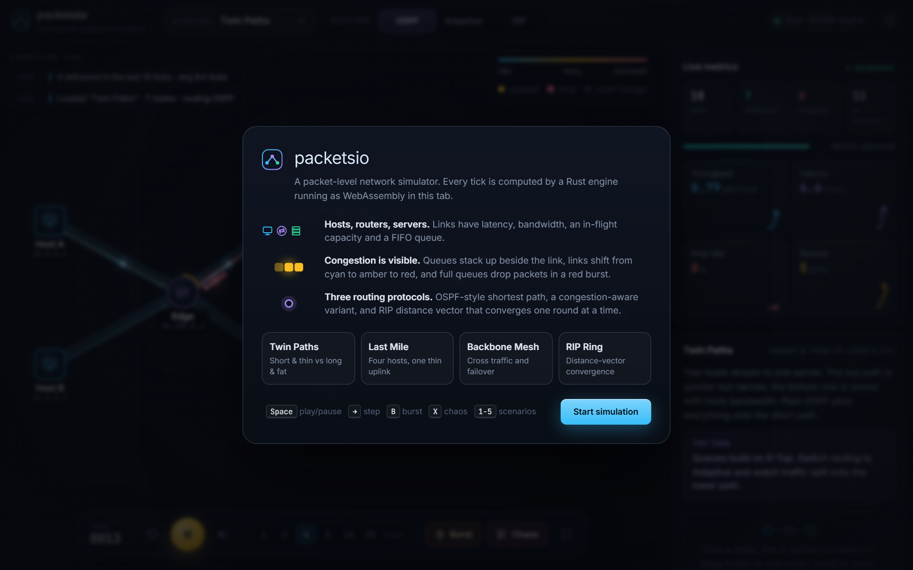
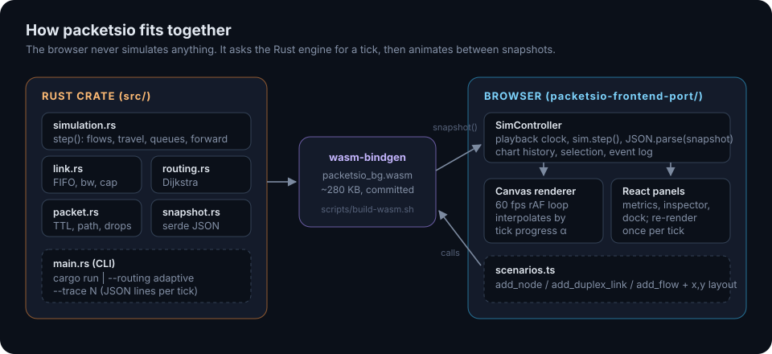
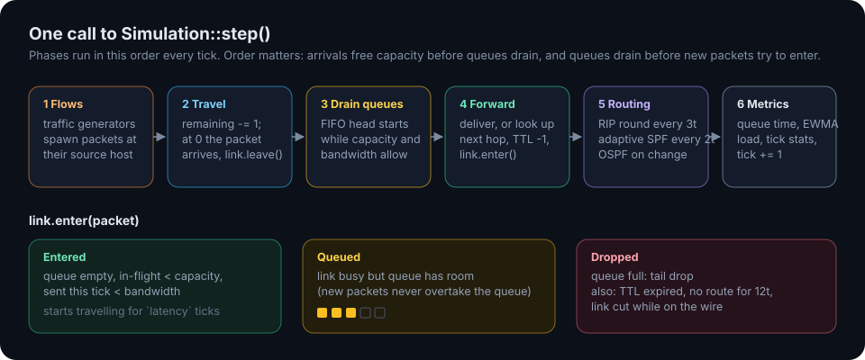

# packetsio

A tick-based network packet simulator written in Rust, compiled to WebAssembly, and rendered live in the browser.



Live: https://packetsio-wcux-eta.vercel.app/ · Full-quality video: [docs/media/demo.mp4](docs/media/demo.mp4)

## What it does

You build (or pick) a network of hosts, routers and servers, attach traffic flows, and step time forward. Every
tick the Rust engine moves packets along links, drains FIFO queues, makes forwarding decisions from per-node
routing tables and drops what does not fit. The web UI draws the result:

- links shift from cyan to amber to red as their queues fill, with moving dashes showing direction of travel
- queued packets stack up as blocks beside the link; a full queue tail-drops the next packet in a red burst
- packets are glowing particles with latency trails, eased along each hop and interpolated between ticks
- live charts for throughput, end-to-end latency, drop rate and total queue depth
- click a node for its IP, MAC, counters and routing table; click a link to see both directions and cut or restore
  it; click a packet to see where it has been and where the current routing tables will send it

Three routing modes can be switched at any time:

| Mode | What it computes | When it updates |
| --- | --- | --- |
| OSPF | Dijkstra over active links, cost = latency | whenever the topology changes |
| Adaptive | Dijkstra with cost = latency + queue drain time, one tick of hysteresis | every 2 ticks |
| RIP | Distance vector, hop count, split horizon, infinity = 16 | one synchronous exchange every 3 ticks |

| | |
| --- | --- |
|  |  |
| Twin Paths under OSPF: everything takes the short, thin path and the Edge queue overflows. | Same traffic with Adaptive routing: load spills onto the longer path and drops stop. |
|  |  |
| Backbone Mesh after "Chaos" cuts the busiest link. In-flight packets are lost, queued ones reroute. | First-run welcome card. |

## How it works



The browser holds no simulation logic. `SimController` calls `sim.step()` on the wasm `Simulation`, parses the
JSON from `sim.snapshot()`, and the canvas renderer animates between the previous and current state using the
fraction of the tick that has elapsed. Scenarios are plain configuration: they call `add_node`,
`add_duplex_link` and `add_flow` and supply x/y positions, which the engine does not know about.



A link has four parameters: `latency` (ticks on the wire), `bandwidth` (packets that may enter per tick),
`capacity` (packets on the wire at once) and `max_queue_size`. A packet that cannot enter waits in the link's FIFO
queue; new packets never overtake the queue. Routers decrement TTL when forwarding. A packet with no route is held
for up to 12 ticks (so RIP has time to converge) before it is dropped.

## Quick start

Requirements: Rust (stable) and Node.js 20+.

```bash
# Rust engine: tests and the CLI demo
cargo test
cargo run                          # 3 pkt/tick through the default 4-node network
cargo run -- --routing adaptive    # same, congestion-aware routing
cargo run -- --trace 40            # one JSON snapshot per tick (JSON lines)

# Web UI (uses the committed wasm build in src/wasm/)
cd packetsio-frontend-port
npm ci
npm run dev                        # http://localhost:5173
npm run build                      # static site in packetsio-frontend-port/dist
```

Keyboard: `Space` play/pause, `→` step, `B` burst, `X` chaos (cut the busiest link), `R` reset, `F` fit view,
`1`–`5` scenarios. Drag nodes to rearrange, scroll to zoom, drag the background to pan.

### Rebuilding the WebAssembly engine

The generated files in `packetsio-frontend-port/src/wasm/` are committed so the frontend (and Vercel) can build
without a Rust toolchain. After changing Rust code:

```bash
rustup target add wasm32-unknown-unknown
cargo install wasm-bindgen-cli --version 0.2.127   # must match the wasm-bindgen version in Cargo.lock
./scripts/build-wasm.sh
```

### Deploying

The frontend is a static Vite site. On Vercel set the root directory to `packetsio-frontend-port`; the included
`vercel.json` sets the install command `npm ci`, build command `npm run build` and output directory `dist`.

## Project layout

```
src/
  simulation.rs      Simulation (wasm-bindgen API), step(), routing protocols, tests
  link.rs            directed link: FIFO queue, bandwidth tokens, capacity, congestion stats
  packet.rs          packet state machine, TTL, path, drop reasons
  routing.rs         Dijkstra / link-state table helpers
  node.rs            node types, addressing, routing table
  snapshot.rs        JSON snapshot + per-tick event types
  metrics.rs         cumulative and per-tick statistics
  main.rs            CLI demo and --trace output
scripts/build-wasm.sh
packetsio-frontend-port/
  src/sim/           wasm loader, SimController, scenarios, snapshot types
  src/render/        canvas renderer and palette
  src/components/    top bar, control dock, metrics, inspector, event feed, onboarding
  src/wasm/          wasm-bindgen output (generated, committed)
docs/media/          demo, screenshots, diagrams
```

## Design notes and trade-offs

- **Engine fixes in this version.** Routing tables used to contain only direct neighbours, so nothing travelled
  more than one hop. A queued packet could lose its slot when a different packet was at the head of the queue,
  TTL counted ticks instead of hops, the reverse links needed for echo replies did not exist, some node types
  shared IP addresses, and the CLI did not compile. All of these are covered by tests in `simulation.rs` now.
- **Deterministic.** Nodes, links and packets live in `BTreeMap`s, so the same inputs always give the same run.
- **Snapshots are JSON.** Simple and debuggable; at the scale of these topologies (tens of nodes, a few hundred
  packets) serialising every tick is cheap. A binary layout would be the next step for much larger networks.
- **Canvas 2D, not WebGL.** Glows are pre-rendered radial sprites drawn with additive blending, which keeps a
  full frame cheap enough for 60 fps without shaders.
- **Interpolation is presentation only.** Motion between ticks is eased in the renderer; the engine's state is
  only ever what `step()` produced.
- **Not modelled:** ARP resolution, packet sizes in bytes, TCP. The protocol enum has ARP and LSA kinds reserved
  for that.
