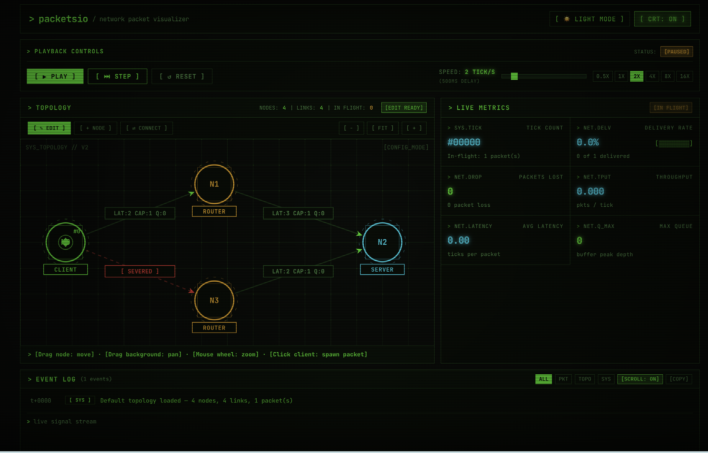

# packetsio

`packetsio` is a tick-based network packet simulation engine written in Rust,
with a React and Vite frontend for visualizing topology, packet movement, and
simulation metrics.


Try it out here: https://packetsio-wcux-eta.vercel.app/

## Repository layout

- `src/` - Rust simulation engine and CLI demo
- `packetsio-frontend-port/` - React, TypeScript, and Vite visualizer
- `packetsio-frontend-port/src/wasm/` - WebAssembly bindings used by the frontend

## Requirements

- Rust and Cargo
- Node.js and npm
- `wasm-pack` if rebuilding the frontend WebAssembly module

## Run the Rust simulation

From the repository root:

```bash
cargo run
```

Run the Rust tests with:

```bash
cargo test
```

## Run the frontend

From `packetsio-frontend-port/`:

```bash
npm install
npm run dev
```

Then open the local URL printed by Vite, usually `http://localhost:5173`.

Create a production build with:

```bash
npm run build
```

The frontend uses the WebAssembly engine when it is available and falls back
to a TypeScript stand-in engine if the module cannot load.

## Rebuild the WebAssembly engine

Install `wasm-pack` if needed, then run this from the repository root:

```bash
wasm-pack build --target web
```

Copy the generated files from `pkg/` into
`packetsio-frontend-port/src/wasm/`, preserving the names expected by the
frontend (`packetsio.js`, `packetsio_bg.wasm`, and their type declarations).

For frontend-specific architecture and interaction details, see
[`packetsio-frontend-port/README.md`](packetsio-frontend-port/README.md).
